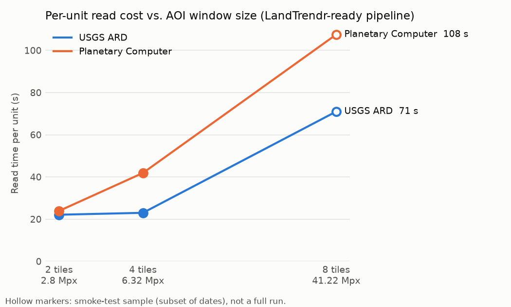

# Benchmarks

What we've measured about DataLoader's imagery providers, how we measured it,
and where the numbers came from. The full narrative, including caveats and
the reasoning behind each decision, is in
[`../DATALOADER_DEVELOPMENT_REPORT.md`](../DATALOADER_DEVELOPMENT_REPORT.md);
this page is the index.

## Method, common to every benchmark

- **Compare like with like.** Providers are only compared on scientifically
  equivalent products (e.g. Landsat Collection 2 Level-2 surface reflectance
  from Planetary Computer vs. the same product as U.S. ARD from USGS), with
  identical grid, QA masking, mosaicking rules, bands, dates and cloud
  filter. Product agreement is checked by diffing pixels on shared dates, not
  assumed.
- **Isolate each run.** Every provider/case runs in its own subprocess, so
  GDAL's `/vsicurl` cache from one run can't speed up the next.
- **Resume after kills.** Long runs are sometimes killed by memory pressure
  from outside the process. The harnesses resume from what's on disk and add
  up timings across attempts rather than restarting.
- **Keep variables separate.** Search scope (how many scenes or tiles an AOI
  touches) and read-window size (pixels per read) are varied independently
  wherever geometry allows.
- **Raw results stay local.** Raw outputs go to `bench/results/`
  (git-ignored — the imagery runs to tens of GB). Compact summaries are
  extracted by scripts into [`data/`](data/), and figures into
  [`../figures/`](../figures/).

## Benchmarks

| Benchmark | Harness | Question | Headline result |
|---|---|---|---|
| Provider baseline / Oregon stress model (2026-09-08/09) | `run_benchmark.py`, `run_case.py`, `cases.py` | Per-scene read cost; what would 2000–2025 Oregon cost? | PC vs. GEE Landsat agree to ~3×10⁻⁶ reflectance. Serial Oregon estimate later revised upward by the large-window test. |
| Large-window COG reads (2026-09-16) | `large_window_bench.py` | Does per-read cost stay linear in window size? | No — throughput degrades substantially beyond ~5 Mpx. |
| Scene-level concurrency (2026-09-16) | `concurrency_bench.py` | How much do `workers` help? | 85% efficiency at 2 workers, down to 39% at 8. Network/provider bound (CPU stays under 30%). |
| Direct-USGS ARD vs. PC (2026-09-18) | `ard_vs_pc_bench.py` | Can ARD be read directly from USGS, and how does it compare? | Yes, per band via M2M with no AWS involvement. Fixed tiles avoid PC's same-date duplicate scenes. |
| ARD tile-boundary scaling (2026-09-18) | `ard_tile_scaling_bench.py` | How do ARD units grow with tiles spanned? | Linear in tile count. |
| ARD vs. PC concurrency (2026-09-18) | `ard_pc_concurrency_bench.py` | Does concurrency help both equally? | No — M2M allows one request at a time per account, so the gap grows from 3.8× to 7.8× at 8 workers. |
| LandTrendr-ready pipeline, 2 → 4 tiles (2026-09-20/22) | `landtrendr_ready_bench.py` | End to end (discovery → masked mosaic → indices → GeoTIFF), which provider scales better? | Near-tie at 2 tiles. At 4 tiles ARD is 9.5% faster in total time. PC per-unit read cost +75% vs. ARD +4%. Products equivalent (correlation ≥0.93 on every shared date but one heavily clouded one). |
| LandTrendr-ready pipeline, 8 tiles (smoke, 2026-09-28) | `landtrendr_ready_bench.py --aoi-preset 8tile --sample-dates 6` | Does PC's per-unit cost keep growing at a 41 Mpx window? What would the full run cost? | Inconclusive: ARD 71 s/unit mean (57 median) vs. PC 108 (45), very wide ranges; projected full run ARD ~7.1 h, PC ~5.0 h. |
| Complete ARD tile history, h003v004 (2026-10-02..04) | `ard_tile_history_bench.py` + `configs/ard_tile_history_h003v004.yaml` | What does a tile's entire 1990–2026 Landsat history cost, direct from USGS? | 3,885/3,885 observations, 14.8 h at 4 workers, 523 GB transferred, 189 GB as uint16. ~1/3 of observations are edge slivers a center-AOI search misses. [`data/ard_tile_history_h003v004.json`](data/ard_tile_history_h003v004.json) |
| Oregon ARD estimate (2026-10-04) | `oregon_ard_estimate.py` | All 23 ARD tiles touching Oregon? | ~88,900 observations, ~11.4 TB transfer, ~4.1 TB stored (masked, no QA), ~14.5 days at 4 workers on one M2M account. [`data/oregon_ard_estimate.json`](data/oregon_ard_estimate.json) |

### LandTrendr-ready scaling summary

Generated by `python bench/summarize_landtrendr.py` →
[`data/landtrendr_scaling.json`](data/landtrendr_scaling.json).

| AOI | Window | Provider | Units | Output dates | Read s/unit | Wall time |
|---|---|---|---|---|---|---|
| 2 tiles | 2.8 Mpx | ARD | 67 | 34 | 22.1 | 25.4 min |
| 2 tiles | 2.8 Mpx | PC | 57 | 40 | 23.9 | 23.6 min |
| 4 tiles | 6.3 Mpx | ARD | 137 | 36 | 23.0 | 54.8 min |
| 4 tiles | 6.3 Mpx | PC | 83 | 44 | 41.9 | 60.0 min |

## Re-running

Benchmark harnesses are kept as the record of how each result was produced. Four of them drive the **pre-1.0** engine/config API -- `run_case.py` (via `run_benchmark.py`), `concurrency_run_case.py`, `ard_pc_concurrency_run_case.py` and `landtrendr_ready_run_case.py` -- so re-run those from the `pre-1.0` git tag. The rest use only the provider interface or their own files and work on the current code; `ard_tile_history_bench.py report` reproduces its committed summary byte-for-byte. For acquiring tile histories, use `data-loader run` (see [large jobs](../../large-jobs.md)) -- the bench script remains for timing measurements.


```bash
python bench/landtrendr_ready_bench.py --aoi-preset 4tile          # full run, both providers
python bench/landtrendr_ready_bench.py --aoi-preset 8tile --sample-dates 6   # smoke test
python bench/summarize_landtrendr.py                                # refresh data/ summary
```

`usgs_ard` needs `USGS_M2M_USERNAME` / `USGS_M2M_TOKEN` in the environment
(see `.env.example`). Planetary Computer needs no credentials.



Figures are regenerated with `python bench/make_figures.py`.
